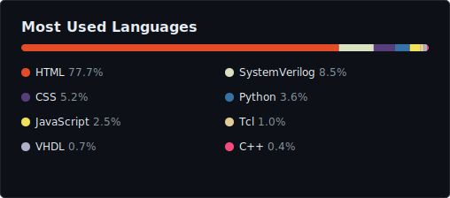

<!-- Animated rainbow divider -->

<!-- Typing SVG header -->

 

## 👋 About Me

- 🔧 **FPGA Engineer** (Costa Rica) — RTL design, VHDL/Verilog, timing closure, CDC analysis, Synopsys Fusion Compiler
- 🚀 **Co-founder** of **[EMU Soluciones](https://emusoluciones.com)** — a digital agency building websites, AI chatbots, and digital strategy for SMBs
- 🎓 **B.Sc. in Electronics Engineering** — Instituto Tecnológico de Costa Rica (**TEC**), Class of 2025
- ⚙️ **Industrial Electronics Technician**
- 🤖 I build **WhatsApp AI chatbots** with n8n self-hosted on Hetzner, and **electronic invoicing integrations** compliant with Costa Rica's tax authority (Hacienda CR)
- 📍 Costa Rica 🇨🇷

 

## 🛠️ What I Build

| | Service |
|:---:|:---|
| 🌐 | **Professional websites** for businesses (e.g. [grupoarcazul.com](https://grupoarcazul.com)) |
| 🤖 | **WhatsApp AI Chatbots** — n8n + WhatsApp Cloud API, self-hosted on Hetzner VPS |
| 📊 | **Digital marketing & social media strategies** |
| 🧾 | **Electronic invoicing integrations** — Costa Rica tax compliance (Hacienda CR) |
| ☁️ | **Cloud infrastructure setup** — Cloudflare, Google Workspace, GitHub Orgs, Cloudinary |

 

## 💻 Tech Stack

**Hardware / FPGA**
 

 
VHDL · Verilog · SystemVerilog · Synopsys Fusion Compiler · Vivado · Quartus

 

**Web**
 

 
n8n · WhatsApp Cloud API

 

**DevOps / Cloud**
 

 
Hetzner VPS · Cloudinary · Google Workspace

 

## 📈 GitHub Insights

 

<!-- Snake contribution animation (requires the GitHub Action workflow) -->

 

## 🤝 Connect

<!-- LinkedIn: agregá tu URL cuando la tengas

-->

 

### ⚡ Bridging hardware and software — from FPGA gates to web APIs

